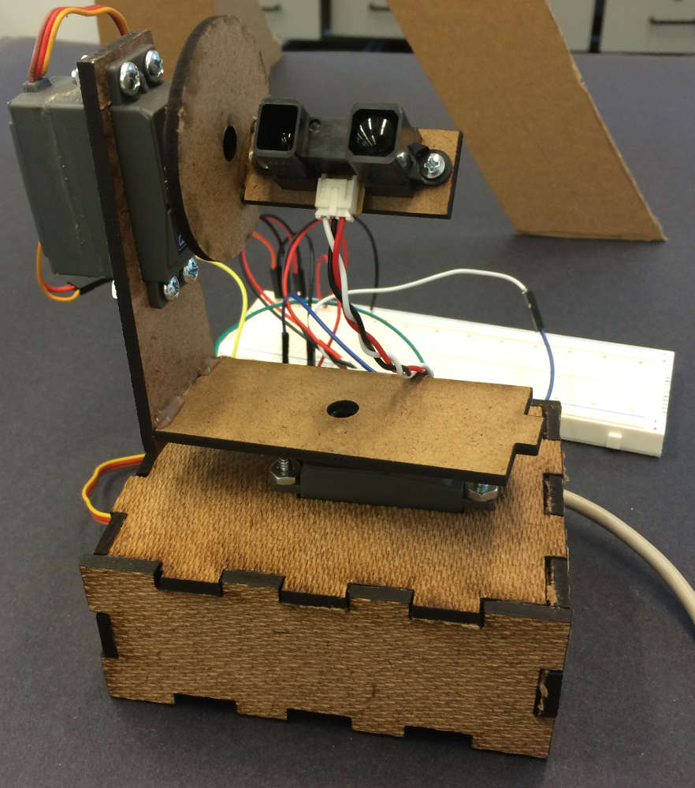
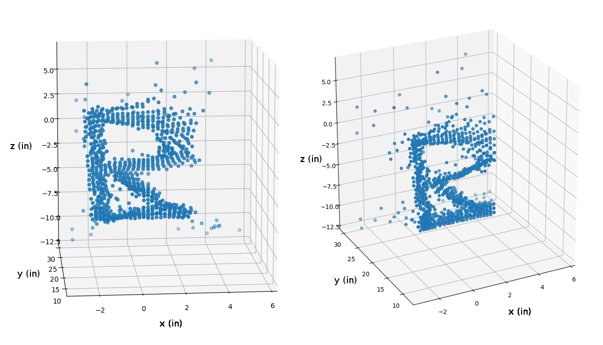

# Principles of Engineering [Lab 2](http://poe.olin.edu/lab2.html) - 3D Scanner

## By Kyle Combes and [Rachel Hwang](https://github.com/rachelhwang)

In this lab, we created a device capable of performing a two-dimensional depth scan (the third dimension) of an object
with an infrared rangefinder, two hobby servos driving a pan-tilt mechanism, and an Arduino Uno R3.

Using the device, we were able to construct a 3D scatter plot of the letter 'R' cut out of cardboard.

For more details, including those on the calibration and scanning processes, please read the [PDF report](report/PoE-lab-2-report.pdf).